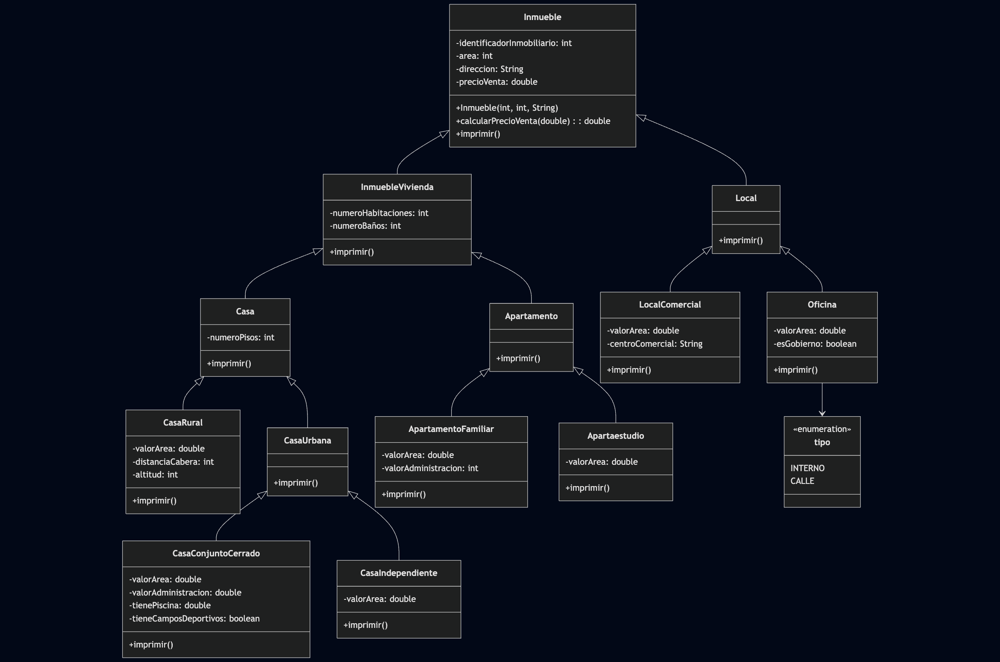

# Actividad 3 - Punto 2: Jerarquía de Inmuebles

## Descripción

Este ejercicio corresponde al **punto 2 de la Actividad 3** de la materia **Programación Orientada a Objetos (POO)**.

El objetivo principal es **modelar una jerarquía de clases para diferentes tipos de inmuebles**. Se implementan clases como `Inmueble`, `InmuebleVivienda`, `Apartamento`, `Casa`, `Local`, `Oficina`, entre otras, aplicando herencia y especialización de atributos y métodos.

## Ejecución

El archivo `Main.java` en la carpeta `prueba` contiene ejemplos de uso de las clases y permite observar el comportamiento de cada tipo de inmueble.

## UML

