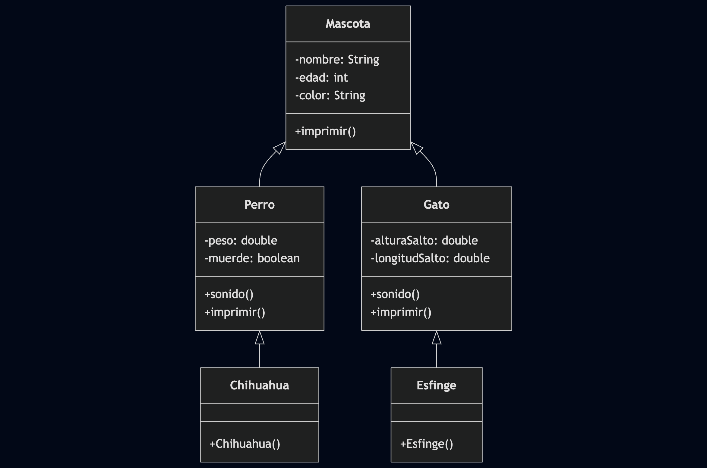

# Actividad 3 - Punto 3: Tienda de Mascotas

## Descripción

Este ejercicio corresponde al **punto 3 de la Actividad 3** de la materia **Programación Orientada a Objetos (POO)**.

El objetivo principal es **modelar una tienda de mascotas** utilizando herencia y polimorfismo. Se implementan clases como `Mascota`, `Perro`, `Gato`, `Chihuahua`, `Esfinge`, entre otras, para representar diferentes tipos de mascotas y sus características.

## Ejecución

El archivo `Main.java` contiene ejemplos de uso de las clases y permite observar el comportamiento de cada tipo de mascota.

## UML

