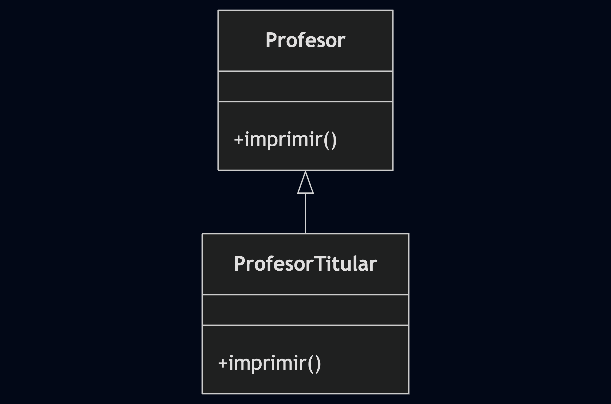

# Actividad 3 - Punto 5: Jerarquía de Profesores

## Descripción

Este ejercicio corresponde al **punto 5 de la Actividad 3** de la materia **Programación Orientada a Objetos (POO)**.

El objetivo principal es **modelar una jerarquía de profesores** utilizando herencia. Se implementan clases como `Profesor` y `ProfesorTitular`, cada una con sus atributos y métodos específicos.

## Ejecución

El archivo `Prueba.java` contiene ejemplos de uso de las clases y permite observar el comportamiento de los profesores.

## UML

