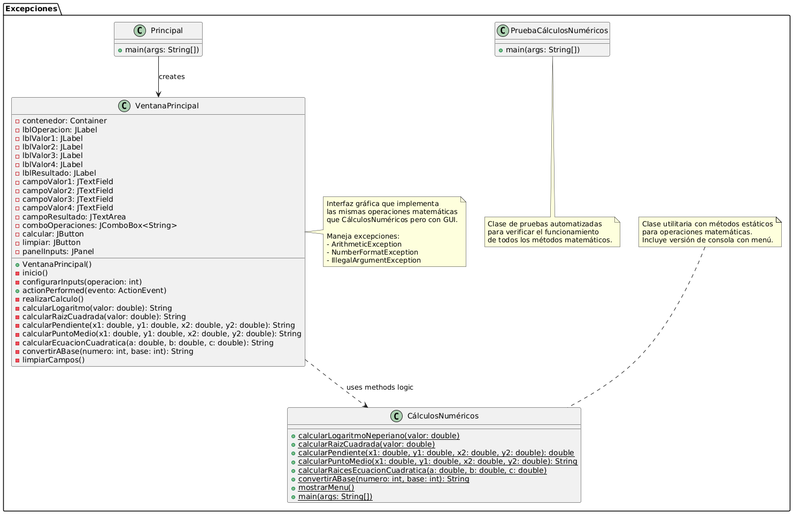

# Actividad 5 - Punto 3: Manejo de Excepciones - Cálculos Numéricos

## Descripción

Este ejercicio implementa una clase llamada `CálculosNuméricos` que realiza diversas operaciones matemáticas con manejo apropiado de excepciones. El proyecto incluye tanto una versión de consola como una **interfaz gráfica de usuario (GUI)** desarrollada con Swing.

## Estructura del Proyecto

El ejercicio está compuesto por las siguientes clases:

- **`CálculosNuméricos`**: Clase principal con todos los métodos matemáticos (versión consola)
- **`VentanaPrincipal`**: Interfaz gráfica que permite usar todas las operaciones de forma visual
- **`Principal`**: Contiene el método `main` que inicia la aplicación gráfica
- **`PruebaCálculosNuméricos`**: Clase de pruebas automatizadas para verificar el funcionamiento

## Funcionalidades Implementadas

### Operaciones Básicas:
1. **Logaritmo Neperiano**: Calcula el logaritmo natural de un número
   - Valida que el número sea positivo
   - Lanza `ArithmeticException` si el valor es ≤ 0

2. **Raíz Cuadrada**: Calcula la raíz cuadrada de un número
   - Valida que el número sea no negativo
   - Lanza `ArithmeticException` si el valor es < 0

### Operaciones Geométricas:
3. **Pendiente de una Línea**: Calcula la pendiente dados dos puntos
   - Fórmula: (y2 - y1) / (x2 - x1)
   - Valida que x2 - x1 ≠ 0
   - Lanza `ArithmeticException` para líneas verticales

4. **Punto Medio**: Calcula el punto medio entre dos puntos
   - Fórmula: ((x1 + x2) / 2, (y1 + y2) / 2)
   - Retorna resultado como String formateado

### Operaciones Algebraicas:
5. **Raíces de Ecuación Cuadrática**: Resuelve ecuaciones de la forma ax² + bx + c = 0
   - Valida que a ≠ 0
   - Valida que el discriminante sea ≥ 0
   - Maneja casos de raíz única y raíces múltiples
   - Lanza `ArithmeticException` para casos inválidos

6. **Conversión de Base**: Convierte números decimales a otras bases
   - Acepta solo enteros positivos
   - Bases válidas: 2 ≤ base ≤ 16
   - Lanza `IllegalArgumentException` para valores fuera de rango
   - Soporta dígitos hexadecimales (A-F)

## Interfaz Gráfica de Usuario (GUI)

### Características de la Ventana:
- **Selector de Operación**: ComboBox que permite elegir entre todas las operaciones disponibles
- **Campos Dinámicos**: Los campos de entrada se adaptan automáticamente según la operación seleccionada
- **Área de Resultado**: Muestra los resultados de los cálculos de forma clara
- **Manejo Visual de Errores**: Utiliza `JOptionPane` para mostrar mensajes de error amigables

### Funcionalidades de la GUI:
- **Interfaz Adaptativa**: Los campos de entrada cambian según la operación seleccionada
- **Validación de Campos**: Verifica que todos los campos requeridos estén llenos
- **Manejo de Excepciones**: Captura y muestra errores de forma amigable al usuario
- **Botones de Acción**: 
  - **Calcular**: Ejecuta la operación seleccionada
  - **Limpiar**: Borra todos los campos de entrada y resultado

### Diseño de la Interfaz:
- Ventana de 450x400 píxeles
- Panel organizado con campos etiquetados
- Área de texto para mostrar resultados
- Diseño intuitivo y fácil de usar

## Manejo de Excepciones

Tanto la versión consola como la GUI manejan los siguientes tipos de excepciones:

- **ArithmeticException**: Para errores matemáticos (división por cero, logaritmo de números negativos, etc.)
- **InputMismatchException**: Para entradas no numéricas del usuario
- **IllegalArgumentException**: Para parámetros fuera de rango válido
- **NumberFormatException**: Para conversiones de texto a número inválidas

## Cómo Usar

### Versión Gráfica (Recomendada):
```bash
javac Excepciones/Principal.java
java Excepciones.Principal
```

### Versión Consola:
```bash
javac Excepciones/CálculosNuméricos.java
java Excepciones.CálculosNuméricos
```

### Ejecutar Pruebas:
```bash
javac Excepciones/PruebaCálculosNuméricos.java
java Excepciones.PruebaCálculosNuméricos
```

## Ejemplos de Uso en la GUI

1. **Logaritmo**: Selecciona "Logaritmo Neperiano", ingresa 2.718, resultado ≈ 1.0
2. **Raíz Cuadrada**: Selecciona "Raíz Cuadrada", ingresa 16, resultado = 4.0
3. **Pendiente**: Selecciona "Pendiente de Línea", ingresa puntos (0,0) y (1,1), resultado = 1.0
4. **Punto Medio**: Selecciona "Punto Medio", ingresa puntos (0,0) y (4,4), resultado = (2.0, 2.0)
5. **Ecuación Cuadrática**: Selecciona "Ecuación Cuadrática", ingresa a=1, b=-5, c=6, resultado = 2.0 y 3.0
6. **Conversión de Base**: Selecciona "Conversión de Base", ingresa 255 y base 16, resultado = FF

## UML - Diagrama de Clases



El diagrama UML muestra la estructura completa del sistema con las siguientes clases:
- **Principal**: Clase de inicio que lanza la interfaz gráfica
- **VentanaPrincipal**: Interfaz gráfica con campos dinámicos y manejo de eventos
- **CálculosNuméricos**: Clase utilitaria con métodos estáticos para operaciones matemáticas
- **PruebaCálculosNuméricos**: Clase de pruebas automatizadas

## Características Técnicas

- **Swing GUI**: Interfaz gráfica moderna y responsiva
- **Manejo Robusto de Excepciones**: Validación exhaustiva con mensajes descriptivos
- **Campos Dinámicos**: La interfaz se adapta automáticamente a cada operación
- **Validación de Entrada**: Verificación completa de datos antes del procesamiento
- **Mensajes de Error Amigables**: Diálogos informativos para guiar al usuario
- **Diseño Modular**: Separación clara entre lógica de negocio y presentación
