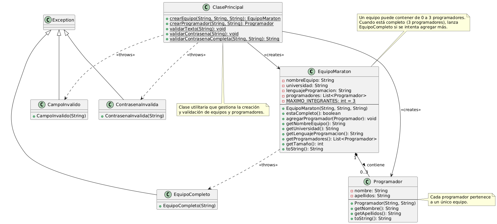

# Punto 4 - Gestión de Equipos de Programación con Manejo de Excepciones

## Descripción

Este ejercicio implementa un sistema de gestión de equipos de programación para maratones, basado en el ejercicio 6.7 del libro "Ejercicios de Programación con Java y UML". El sistema incluye manejo robusto de excepciones, interfaz gráfica adaptativa y validaciones exhaustivas.

## Diagrama UML



## Características Implementadas

### Gestión de Equipos
- Creación de equipos con validación de datos
- Control de integrantes (máximo 3 programadores)
- Información completa del equipo (nombre, universidad, lenguaje)

### Gestión de Programadores
- Validación de nombres y apellidos (solo texto, máximo 20 caracteres)
- Control de caracteres permitidos (sin números)
- Agregación controlada al equipo

### Validación de Contraseñas
- Mínimo 8 caracteres
- Debe contener mayúsculas, minúsculas, números y caracteres especiales
- No permite espacios en blanco
- Confirmación de contraseña obligatoria

### Interfaz Gráfica Adaptativa
- Campos dinámicos según la operación seleccionada
- Feedback visual con colores para errores y éxitos
- Tres operaciones principales: Crear Equipo, Agregar Programador, Validar Contraseña

## Clases Principales

### EquipoMaraton
- Representa un equipo de programación
- Contiene máximo 3 programadores
- Lanza `EquipoCompleto` cuando se intenta exceder el límite

### Programador
- Representa un integrante del equipo
- Validación estricta de nombre y apellidos

### Excepciones Personalizadas
- `EquipoCompleto`: Equipo con 3 integrantes completo
- `CampoInvalido`: Validaciones de texto fallidas
- `ContrasenaInvalida`: Validaciones de contraseña fallidas

## Ejecución

### Compilar y ejecutar la aplicación
```bash
javac *.java
java Principal
```

### Ejecutar las pruebas unitarias
```bash
java PruebaClase
```

## Pruebas Incluidas

El proyecto incluye pruebas exhaustivas que cubren:
- ✅ Casos exitosos de creación y validación
- ❌ Manejo de errores y excepciones
- 🔄 Casos límite y validaciones extremas

### Resultados de Pruebas
- Creación de equipos válidos e inválidos
- Gestión de programadores con validaciones
- Validación de contraseñas con múltiples criterios
- Control de límites de equipo

## Arquitectura

- **Separación de responsabilidades**: Lógica separada de la interfaz
- **Excepciones personalizadas**: Manejo específico de errores
- **GUI adaptativa**: Interfaz que cambia según la operación
- **Validaciones exhaustivas**: Control en todos los puntos de entrada
