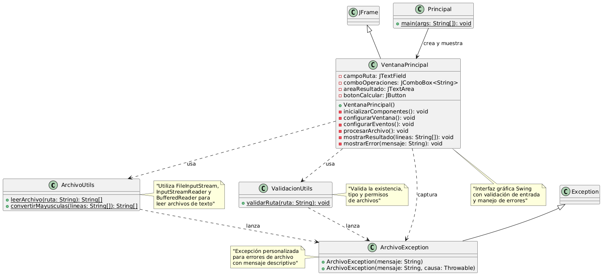

# Actividad 5 - Punto 5: Lector de Archivos con Manejo de Excepciones

## Descripción

Este ejercicio corresponde a un punto práctico de la materia **Programación Orientada a Objetos (POO)**.

El objetivo principal era **desarrollar una aplicación con interfaz gráfica de usuario (GUI)** que permita leer archivos de texto utilizando flujos de entrada en Java (`FileInputStream`, `InputStreamReader`, `BufferedReader`), con manejo de excepciones personalizadas y arquitectura modular.

La aplicación permite al usuario ingresar la ruta de un archivo de texto y seleccionar si desea leer el contenido original o convertirlo a mayúsculas. En caso de errores (archivo inexistente, sin permisos, etc.), se muestran mensajes informativos mediante cuadros de diálogo.

## Estructura del proyecto

El ejercicio está compuesto por las siguientes clases organizadas en paquetes:

### Paquete `util`
- `ArchivoUtils`: contiene métodos estáticos para leer archivos y convertir texto a mayúsculas.
- `ValidacionUtils`: contiene métodos para validar rutas de archivos.

### Paquete `excepciones`
- `ArchivoException`: excepción personalizada para manejar errores relacionados con archivos.

### Paquete `interfaz`
- `VentanaPrincipal`: contiene todos los elementos de la interfaz gráfica (campos de texto, ComboBox, botones y área de resultado), así como la lógica necesaria para:
  - Obtener la ruta del archivo ingresada por el usuario.
  - Procesar el archivo según la operación seleccionada.
  - Manejar las excepciones y mostrar mensajes de error.
  - Mostrar el contenido del archivo en el área de texto.

### Paquete `main`
- `Principal`: contiene el método `main` que inicia la aplicación, creando una instancia de la clase `VentanaPrincipal`.

### Paquete `test`
- `PruebaClase`: contiene pruebas automáticas para validar el funcionamiento de todas las clases.

## Funcionalidad

- Al ejecutar la aplicación se abre una ventana con:
  - Campo de texto para ingresar la ruta del archivo.
  - ComboBox con opciones: "Leer archivo" y "Leer y convertir a mayúsculas".
  - Botón **Calcular** para procesar el archivo.
  - Área de texto para mostrar el resultado.

- Al hacer clic en el botón **Calcular** o presionar Enter, el programa:
  - Valida que la ruta no esté vacía.
  - Verifica que el archivo exista y sea legible.
  - Lee el contenido del archivo línea por línea.
  - Si se selecciona "Leer y convertir a mayúsculas", transforma todo el texto.
  - Muestra el resultado numerando las líneas en el área de texto.
  - Si ocurre algún error, muestra un mensaje descriptivo mediante `JOptionPane`.

## UML

